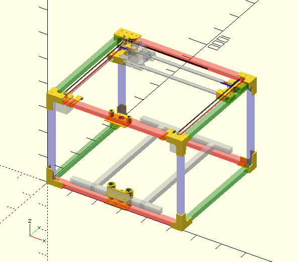

# Overview

This is my attempt at designing a 3D printer with [CoreXY](http://corexy.com/theory.html) motion.  There's nothing novel about it except all plastic parts were designed in the open source [OpenSCAD](http://www.openscad.org).  So far it has successfully printed a 20mm calibration cube.

The printer has been built around some 2020 aluminium extrusions I had lying around:

- 4x 500mm beams for the frame (X)
- 4x 420mm beams for the frame (Y)
- 4x 360mm beams for the frame (Z)
- 2x 360mm beams for the bed (X)
- 2x 420mm beams for the bed (Y)

For the linear motion, 4x 12x400mm stainless steel rods (X and Y) and 4x 10x400mm (Z axises) have been used together with 8x LM12UU bearings and IGUS DryLin RJMP-01-10 bearings.

The plastic parts were printed in PLA, with some of the load bearing parts printed at 100% infill.

In the current design it requires 4 NEMA17 stepper motors (two for the corexy motion and two to support the bed in the Z direction).

For the extruder and hotend, an [E3D Titan Extruder](https://e3d-online.com/Titan-Extruder) is used with an [E3D v6 HotEnd](https://e3d-online.com/E3D-v6/Full-Kit/v6-1.75mm-Universal).

Electronics wise, it uses an Arduino Mega2560 r3 board and has been tested with both:

- 4x [Big Easy Driver](http://www.schmalzhaus.com/BigEasyDriver/) stepper motor drivers and a custom board with MOSFETs and misc support electronics
- A standard [RAMPS v1.4](http://reprap.org/wiki/RAMPS_1.4) board

The Arduino board runs the [Marlin 1.1.0 RC8](https://github.com/MarlinFirmware/Marlin) firmware with the following settings in `Configuration.h`:

	#define COREXY
	// Travel limits after homing (units are in mm)
	#define X_MAX_POS 290
	#define Y_MAX_POS 275
	#define Z_MAX_POS 205

The Y max value is no longer up-to-date because it was determined when I was using a cantilever design for the bed (single Z axis).  Unfortunately, it wasn't rigid enough and I got some 5mm flex at the far end.  I've since moved on to a dual Z-axis design to support the bed in two places (not reflected in the .scad file).

This is work in progress but here's a quick screenshot from OpenSCAD of the general idea (not all parts are shown).

